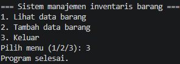

# Studi-Kasus-6-DDP
#sistem manajemen inventtaris barang
program ini digunakan untuk mencatat dan melihat data stok barang pada sebuah toko. data barang disimpan menggunakan file JSON.

#penjelasan kode program
"import json" digunakan untuk mengolah data dalam format json

"baca_data()" digunakan untuk membaca data barang dari file json

"tampilkan_data" digunakan untuk menampilkan seluruh data barang

"append" digunakan untuk menambahkan data baru kedalam list

"json.load" digunakan untuk membaca data dari file json

"json.dump" digunakan untuk menyimpan data ke file json

"while true" digunakan agar program terus berjalan sampai pengguna itu memilih keluar.

"break" digunakan untuk mengentikan program

#Hasil Output Program

1. Daftar Barang
Screenshot ini menunjukkan tampilan daftar barang saat program dijalankan.awalnya belum ada data barang yang tersimpan.

 2. Tambah Data Barang
Screenshot ini menunjukkan proses menambahkan data barang baru, yaitu Headset Bluetooth dengan stok 10 pcs.

3. Lihat Daftar Barang
Screenshot ini menunjukkan data Headset Bluetooth yang berhasil ditambahkan dan sudah muncul di daftar inventaris.

 4. Keluar Program
Screenshot ini menunjukkan program berhasil dihentikan setelah pengguna memilih menu keluar.

